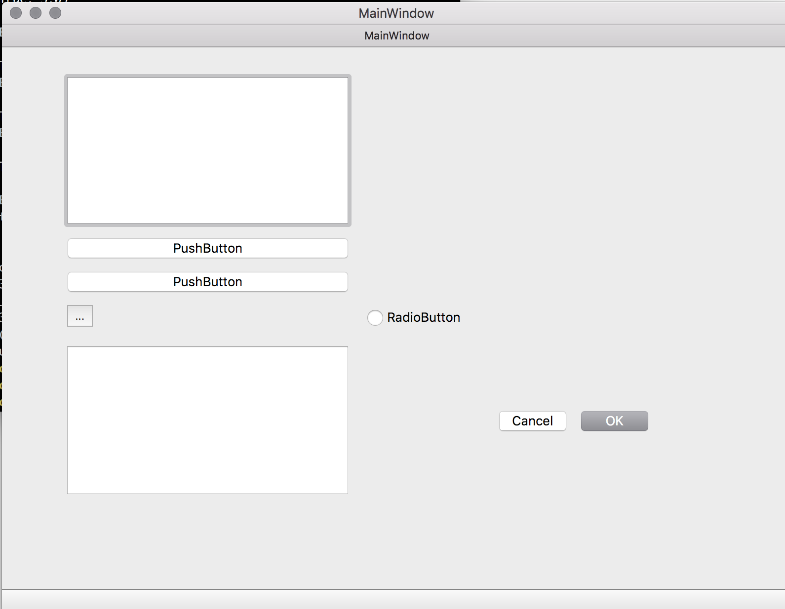

Date: 20180603

一直没有用起来Designer，感觉是很蠢的，虽然手动写界面代码有收获，但是有点迷茫，看不到全局的溺水感。

试着用`pyuic5 -o out.py out.ui`，但是不知道如何用这个界面文件，且看起来非常混乱（是自己偏见），而忽视了用`Designer`的最大优势在于：

**界面和逻辑的分离。**

看我自己前面的笔记，都是界面和需要处理的逻辑混杂在一起，比较好的处理方式是，界面文件随着界面的丰富迭代而更新，使用界面文件的文件不用做什么大的改动。下面是个例子：

*界面文件 -- 由Qt Designer生成：*

```python
# -*- coding: utf-8 -*-

# Form implementation generated from reading ui file 'firstMainWin.ui'
#
# Created by: PyQt5 UI code generator 5.10.1
#
# WARNING! All changes made in this file will be lost!

from PyQt5 import QtCore, QtGui, QtWidgets

class Ui_MainWindow(object):
    def setupUi(self, MainWindow):
        MainWindow.setObjectName("MainWindow")
        MainWindow.resize(800, 600)
        self.centralwidget = QtWidgets.QWidget(MainWindow)
        self.centralwidget.setObjectName("centralwidget")
        self.gridLayoutWidget = QtWidgets.QWidget(self.centralwidget)
        self.gridLayoutWidget.setGeometry(QtCore.QRect(60, 30, 601, 431))
        self.gridLayoutWidget.setObjectName("gridLayoutWidget")
        self.gridLayout = QtWidgets.QGridLayout(self.gridLayoutWidget)
        self.gridLayout.setContentsMargins(0, 0, 0, 0)
        self.gridLayout.setObjectName("gridLayout")
        self.horizontalLayout = QtWidgets.QHBoxLayout()
        self.horizontalLayout.setObjectName("horizontalLayout")
        self.gridLayout.addLayout(self.horizontalLayout, 4, 0, 1, 1)
        self.toolButton = QtWidgets.QToolButton(self.gridLayoutWidget)
        self.toolButton.setObjectName("toolButton")
        self.gridLayout.addWidget(self.toolButton, 6, 0, 1, 1)
        self.pushButton_2 = QtWidgets.QPushButton(self.gridLayoutWidget)
        self.pushButton_2.setObjectName("pushButton_2")
        self.gridLayout.addWidget(self.pushButton_2, 1, 0, 1, 1)
        self.pushButton = QtWidgets.QPushButton(self.gridLayoutWidget)
        self.pushButton.setObjectName("pushButton")
        self.gridLayout.addWidget(self.pushButton, 5, 0, 1, 1)
        self.radioButton = QtWidgets.QRadioButton(self.gridLayoutWidget)
        self.radioButton.setObjectName("radioButton")
        self.gridLayout.addWidget(self.radioButton, 6, 1, 1, 1)
        self.listView = QtWidgets.QListView(self.gridLayoutWidget)
        self.listView.setObjectName("listView")
        self.gridLayout.addWidget(self.listView, 0, 0, 1, 1)
        self.treeView = QtWidgets.QTreeView(self.gridLayoutWidget)
        self.treeView.setObjectName("treeView")
        self.gridLayout.addWidget(self.treeView, 8, 0, 1, 1)
        self.buttonBox = QtWidgets.QDialogButtonBox(self.gridLayoutWidget)
        self.buttonBox.setStandardButtons(QtWidgets.QDialogButtonBox.Cancel|QtWidgets.QDialogButtonBox.Ok)
        self.buttonBox.setObjectName("buttonBox")
        self.gridLayout.addWidget(self.buttonBox, 8, 1, 1, 1)
        MainWindow.setCentralWidget(self.centralwidget)
        self.menubar = QtWidgets.QMenuBar(MainWindow)
        self.menubar.setGeometry(QtCore.QRect(0, 0, 800, 22))
        self.menubar.setObjectName("menubar")
        MainWindow.setMenuBar(self.menubar)
        self.statusbar = QtWidgets.QStatusBar(MainWindow)
        self.statusbar.setObjectName("statusbar")
        MainWindow.setStatusBar(self.statusbar)

        self.retranslateUi(MainWindow)
        QtCore.QMetaObject.connectSlotsByName(MainWindow)

    def retranslateUi(self, MainWindow):
        _translate = QtCore.QCoreApplication.translate
        MainWindow.setWindowTitle(_translate("MainWindow", "MainWindow"))
        self.toolButton.setText(_translate("MainWindow", "..."))
        self.pushButton_2.setText(_translate("MainWindow", "PushButton"))
        self.pushButton.setText(_translate("MainWindow", "PushButton"))
        self.radioButton.setText(_translate("MainWindow", "RadioButton"))
```

*调用界面文件的文件：*

```python
# CallFirstMainWin.py
import sys
from PyQt5.QtGui import *
from PyQt5.QtWidgets import *
from PyQt5.QtCore import QCoreApplication, Qt, pyqtSignal, QObject

from firstMainWin import * # 从界面文件中导入

class MyMainWindow(QMainWindow, Ui_MainWindow): # Ui_MainWindow是界面文件中的类
	def __init__(self, parent=None):
		super(MyMainWindow, self).__init__(parent)
		self.setupUi(self)
	
if __name__ == '__main__':
	app = QApplication(sys.argv)
	myWin = MyMainWindow()
	myWin.show()
	sys.exit(app.exec_())
```

执行: `python3 CallFirstMainWin.py`

显示效果：


非常轻松地就生成了这样内容丰富的界面。