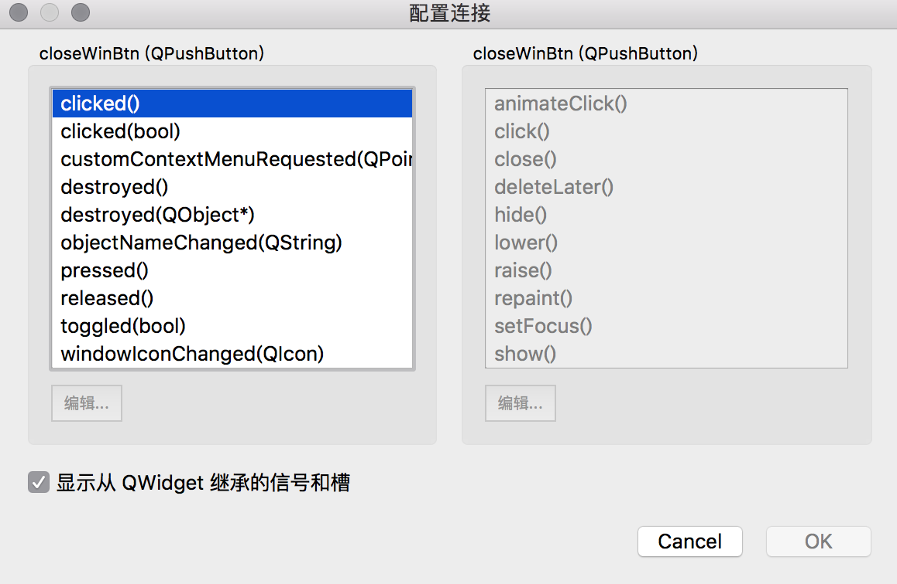
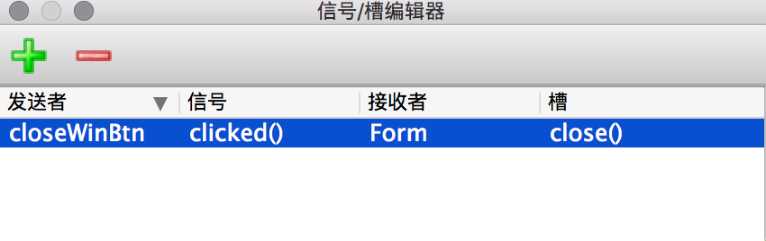

### 简介

Qt编程中，通过Qt的信号槽机制**对鼠标或键盘在界面上的操作**进行响应处理。

不同的控件能够发射的信号种类和触发时机是不同的：能发射什么信号，在什么情况下发射信号，都有明确的规定。

**如何为控件发射的信号指定对应的槽函数呢？**三种方法：

- 在窗口的UI设计中操作添加信号和槽
- 通过代码连接信号和槽
- 通过Eric这个IDE的生成对话框代码的功能产生信号和槽

### 新手进阶

关于信号槽，学习时面临两个问题：

- PyQt5有哪些信号与槽？
- 如何使用这些信号与槽？

在Qt Designer中，有两种操作方式用于添加信号槽，很有趣，记录一下。

第一种，通过Edit --> 编辑信号槽，左键按住空间不放，向接地线一样接到主窗体。然后会弹出对话框：

勾选显示从QWidget继承的信号和槽，才可以显示出一堆选项。左边是信号，右边是槽，这都是系统自定义好的。如果用自己定义的信号，自己定义的槽，我前面有针对这个话题写了文章，也在这个repo中。

第二种，菜单栏上视图--> 信号槽编辑器，弹出：

双击进入编辑选择这四个对象。

