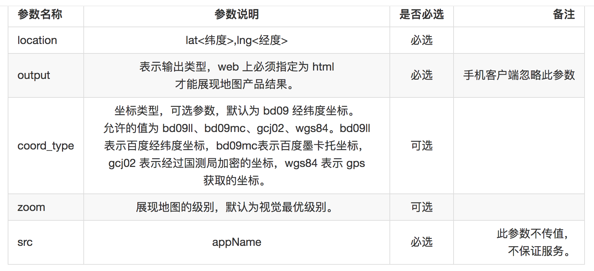
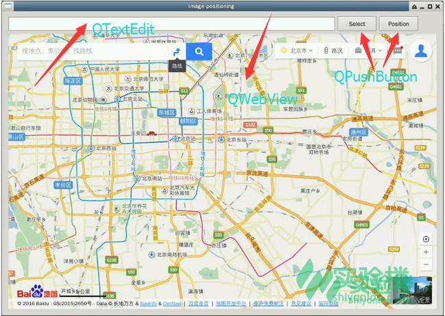

https://www.shiyanlou.com/courses/604/labs/1995/document

## 一、实验说明

**知识点：**

- PyQt5 框架基本GUI组件的使用
- PyQt5 中信号和槽的用法
- PyQt5 中 QWebView 的基本用法
- 百度地图 URL API 标点功能的用法
- 利用 `piexif` 库实现相片 GPS 信息的提取

## 二、理论基础

### 1.Exif信息

Exif 是一种图像文件格式，它的数据存储与 JPEG 格式是完全相同的。实际上 Exif 格式就是在 JPEG 格式头部插入了数码照片的信息，包括拍摄时的光圈、快门、白平衡、ISO、焦距、日期时间等各种和拍摄条件以及相机品牌、型号、色彩编码、拍摄时录制的声音以及 GPS 全球定位系统数据、缩略图等。**这节课我们只用到了 Exif 中的 GPS信息，将 GPS信息 提取出之后，我们就可以用 经纬度 来定位相片拍摄的位置了**。

### 2. PyQt5

是创建GUI应用程序的工具包。是`Python`语言和`Qt`的成功融合。

### 3. 信号与槽

**信号**和**槽**是Qt的核心机制。在创建事件循环之后，通过建立信号与槽的连接可以实现对象之间的通信。信号发射时，连接的槽函数将会自动执行。`object.signal.connect()`连接。

### 4. 百度地图-URI API

只需要按照接口规范构造一条标准的URI，就可以在PC和移动端浏览器或者移动开发应用中调起百度地图产品，进行地图展示与检索，线路查询，导航等功能。

本次实验用到的是百度地图的**反地址解析**接口，经过逆地理编码后，以标注的形式显示出位置和地址信息。

**服务地址**

http://api.map.baidu.com/geocoder // PC &Webap服务地址



参数类型以及含义解释，使用示例：

http://api.map.baidu.com/geocoder?location=39.990912172420714,116.32715863448607&coord_type=gcj02&output=html&src=yourCompanyName|yourAppName

这种API不是通过浏览器输入栏打开就有的。

## 三、环境配置

?? Python版本切换到3.4 ??

**1.安装`piexif`模块**

`sudo pip3 install piexif`

**2.PyQt5依赖Qt5，先把Qt安装上。**

```shell
mkdir download && cd download
// 下载Qt 5.7.0
wget http://mirror.bit.edu.cn/qtproject/archive/qt/5.7/5.7.0/qt-opensource-linux-x64-5.7.0.run
// 赋予执行权限
sudo chmod 777 qt-opensource-linux-x64-5.7.0.run
```

至此开始安装，一路next。但是这个依赖图形界面，不知道服务器支不支持。

**3.安装PyQt5**

`sudo apt-get install python3-pyqt5`

这种安装方法默认不带`QWebKit`模块，手动安装一下。

`sudo apt-get install python3-pyqt5.qtwebkit`

**到此开发环境就搭建好了。**


## 四、代码实现

实现效果：



界面元素有：

- `QLineEdit`:允许用户输入或编辑单行的纯文本，用于显示图片路径
- `QPushButton`：按钮，点击时发射`clicked()`信号，实现选择图片的按钮和定位的按钮
- `QWebView`：是一个可以**显示和编辑Web文档**的组件，相当于简单的浏览器


关于`QtWebKitWidgets`包不存在的解决方案。

http://www.widlabs.com/article/no-module-named-pyqt5-qtwebkitwidgets

果然是要改成`QtWebEngineWidgets`，此外这个特性是比较新的，因此用`Anaconda3`，在`Python3.6`下是没有问题的。

`conda install -c jfear piexif`

使用`pip3 install piexif`在Linux上出现问题，改成用`conda`安装就好了。

